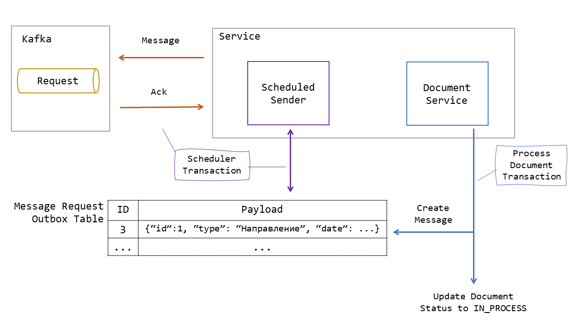
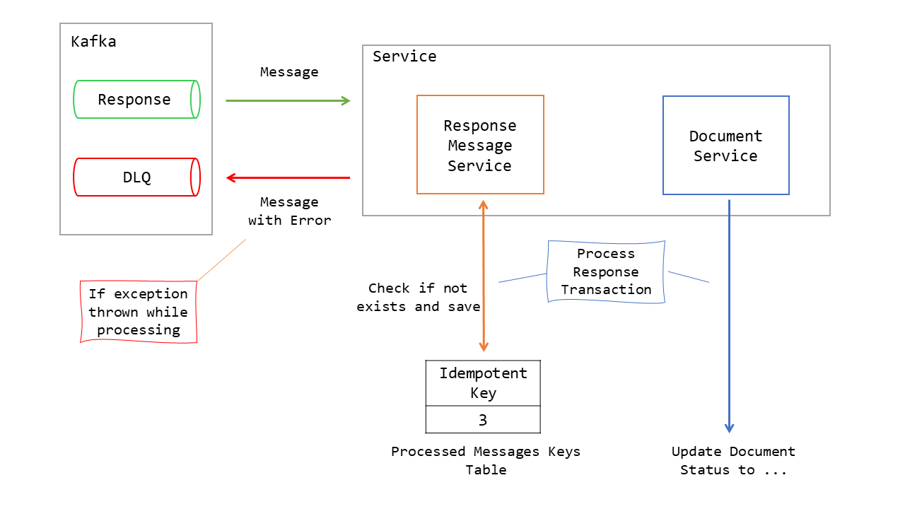

## Описание
Фул стек приложение - справочник документов c DLQ и паттернами Outbox и Idempotent Consumer.
### Структура

- `backend` - Бэкенд на java.
- `ui` - Фронтенд на react + redux.

### Отправка документа в обработку с Outbox Pattern 


1. В рамках одной транзакции обновляется статус документа и сохраняется сообщение для кафки в таблицу `message_request_outbox`
2. Периодически вызывается `ScheduledMessageRequestSender`, который берет сообщение из этой таблицы,
отправляет его в `process_document` и ждет ответа от брокера. В случае успеха удаляет сообщение. 
Отправка и удаление тоже выполняются в одной транзакции  

### Получение результата обработки документа с Idempotent Consumer и DLQ



#### Idempotent Consumer
В таблице `processed_messages_keys`, куда сохраняются все `idempotentKey` обработанных входящих сообщений, 
идет поиск ключа полученного сообщения. Если он не найден, то его `idempotentKey` сохранится, 
а статус документа обновится на полученный.
#### DLQ
Если в процессе обработки сообщения возникли исключения, то `KafkaErrorHandler` перехватит их, а само
сообщение и ошибку обернет в `DlqMessageResponseDto`: 
```json
{ 
  "errorMessage":"Could not resolve method parameter at index 0 in ...",
  "statusResponse":
    {
      "idempotentKey": "",
      "documentId": 100,
      "status": "ACCEPTED"
    }
}
```
И отправит в топик `response_dlq`.

## Запуск
### Подготовка
Нужно установить:
- [node](https://nodejs.org) - front
- [openjdk](https://openjdk.java.net) 15 - java бэк
- [docker](https://www.docker.com/get-started/)

### Сборка

Фронтенд
```
./gradlew ui:build
```
Бэкенд
```
./gradlew backend:bootJar
```
### Запуск через docker-compose
```
docker-compose up
```

### Адрес страницы
```
http://localhost:9000/#/
```
## Использование
Создать документ и отправить в обработку. После этого в топик `response_document` нужно отправить сообщение вида:
```json
 {
   "idempotentKey": 1,
   "documentId": 1,
   "status": "ACCEPTED"
 }
```
* `idempotentKey` - это уникальный идентификатор сообщения
* `documentId` - номер документа, отправленного в обработку
* `status` - результат обработки документа, может быть или `ACCEPTED` или `DECLINED`.
